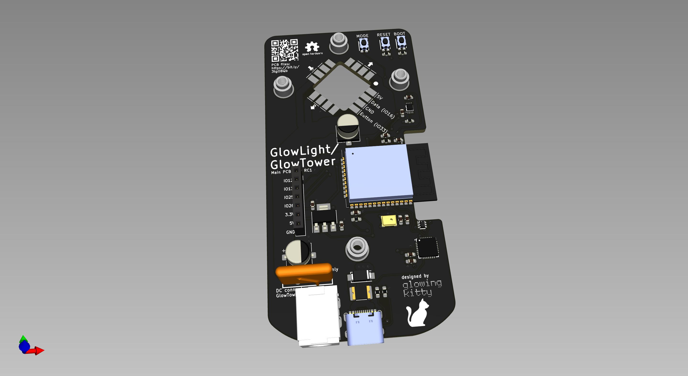
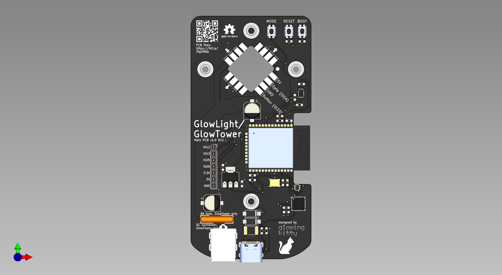
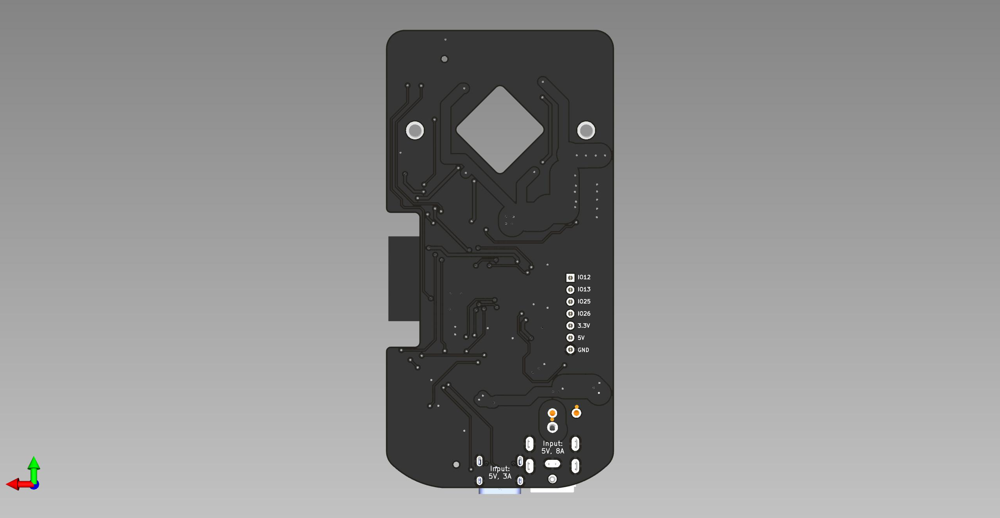

# GlowTower PCB

The main PCB for GlowTower, as well as GlowLight. Controls the connected LED strips via an ESP32 and WLED. But you can also upload your own software to the ESP32 and connect additional hardware (like sensors) to the pins on the PCB.

## Links

- [Schematic](https://github.com/glowingkitty/GlowTower/blob/main/GlowTowerPCB/GlowTowerPCB.pdf)
- [Interactive BOM](https://htmlpreview.github.io/?https://github.com/glowingkitty/GlowTower/blob/main/GlowTowerPCB/bom/ibom.html)
- [3D printable stencil](https://github.com/glowingkitty/GlowTower/blob/main/GlowTowerPCB/stencil.stl)