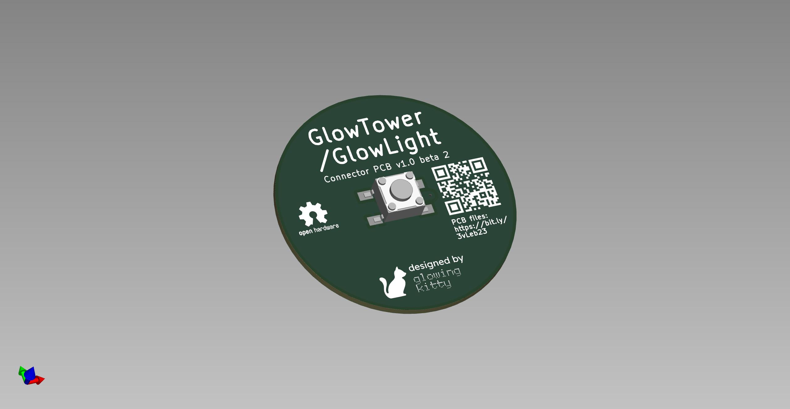
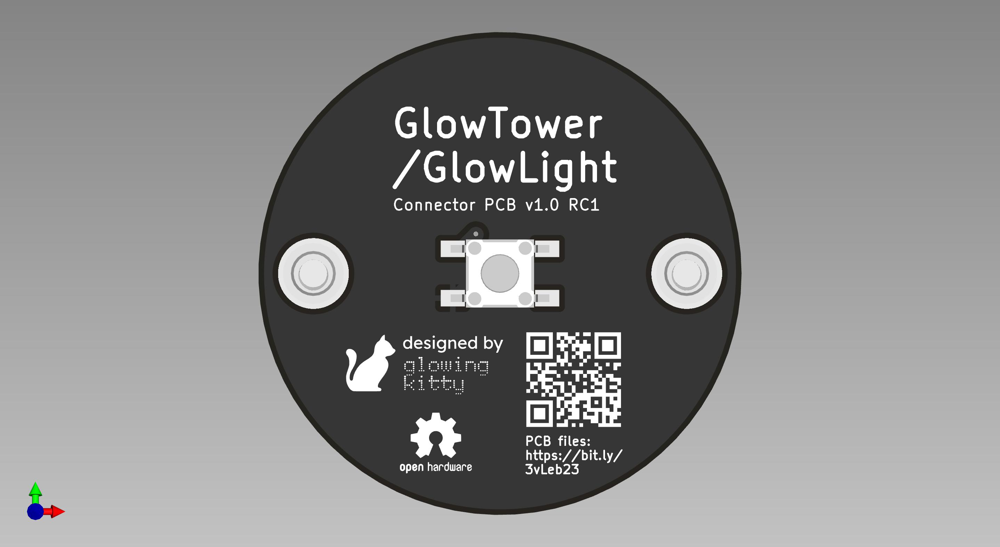
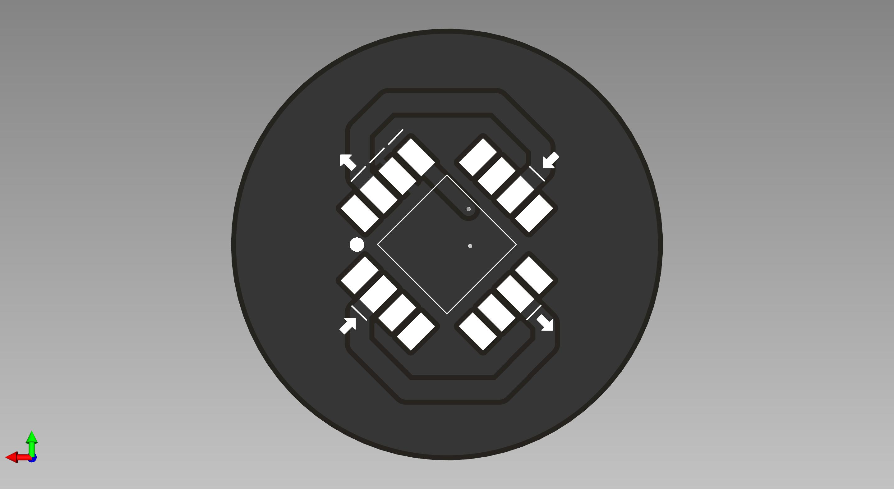

# GlowTower/GlowLight Connector PCB

This PCB connects the LED strips in GlowTower & GlowLight with each other and therefore removes the need for wires. But it also contains the main control button, for turning on/off the lamp and quickly switch the animation.

## Links

- [Schematic](https://github.com/glowingkitty/GlowTower/blob/main/GlowTower_LED_connector_PCB/GlowTower_LED_connector_PCB.pdf)
- [Interactive BOM](https://htmlpreview.github.io/?https://github.com/glowingkitty/GlowTower/blob/main/GlowTower_LED_connector_PCB/bom/ibom.html)
- [PCB stencils](https://github.com/glowingkitty/GlowTower/blob/main/GlowTower_LED_connector_PCB/PCB%20stencils)