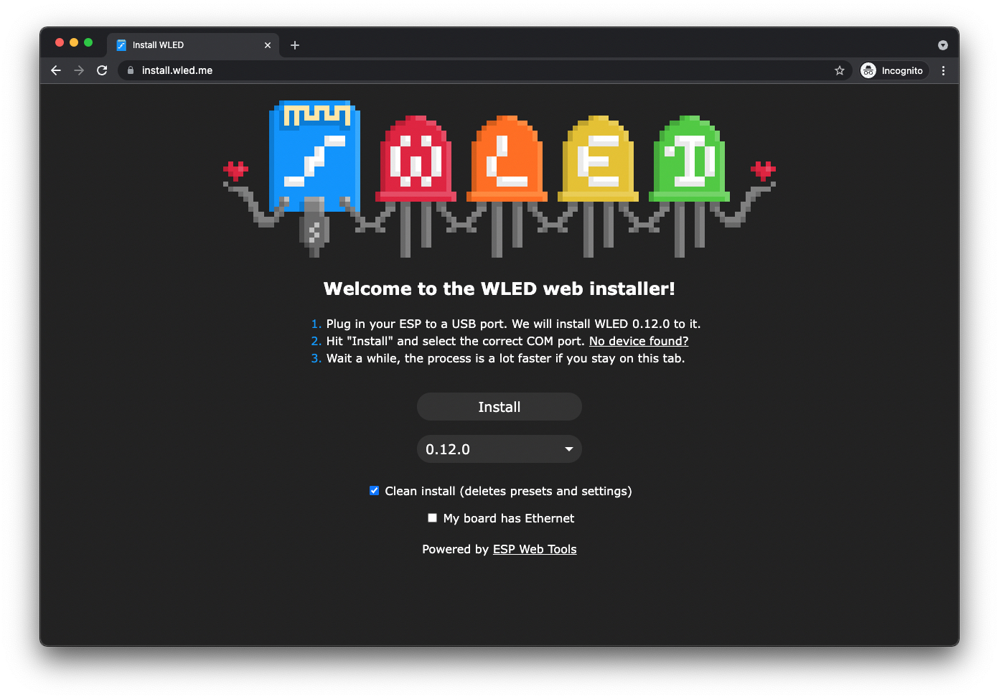
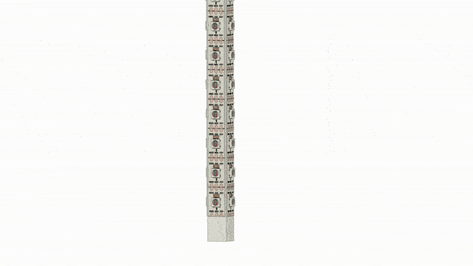
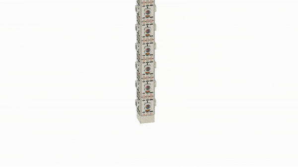
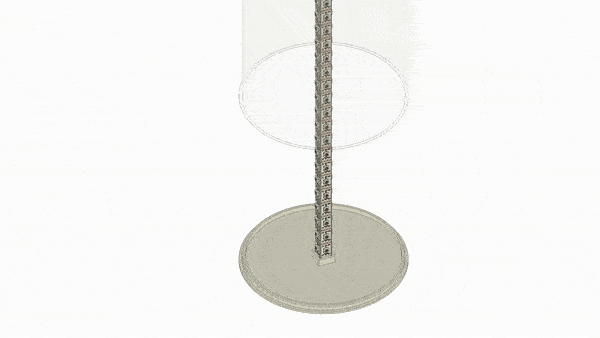
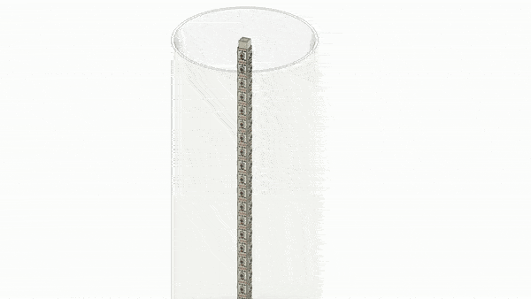
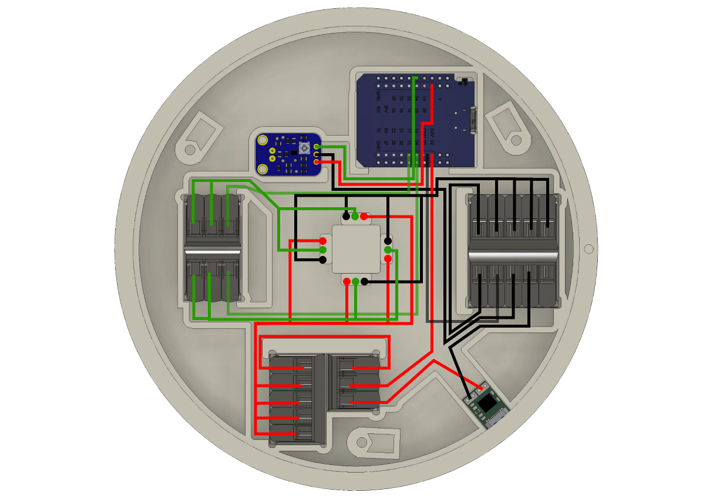
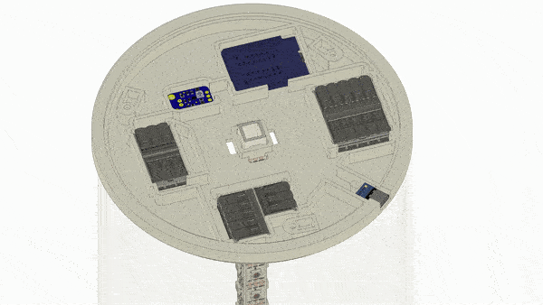

## What is this project?

A beautiful looking LED lamp for lighting up your home or setting the right mood at house parties - with animations that can react to music.

Want to double-check if you are building it correctly? [Download the "GlowTower.step" file from GrabCAD](https://grabcad.com/library/glowtower-1)

## Required tools

- 3D printer (tested with MSLA 3d printer, but every other 3D printer should work as well. With a minimum print area of 16x12x16cm)
- screwdriver (for M3 screws)
- soldering equipment

## Required materials

- **Ø 160/154 mm** acrylic tube, 1m long (if you prefer vibrant colors and bright light: frosted. If you prefer seeing no single LED: white)
- **min. 260ml** of 3D printing resin (or a similar amount of filament, if you use an FDM printer)
- **1x 1m** aluminium square tube, 10x10mm
- **1m** WS2812B or WS2812B Eco LED strip, 60 LEDs/meter, white PCB
- **1x** USB-C PD board ZYPDS
- **1x** ESP32 D1 Mini
- **1x** MAX4466 microphone
- **3x** WAGO 221-415 connector
- **3x** WAGO 221-413 connector
- **3x** M3 nuts
- **3x** M3 8mm screws flat head
- wires (ideally in red, white or black, green)
- heat resistant tape
- optional: **4x** 22mm felt gliders
- optional: epoxy glue or another kind of strong glue

## How to build the GlowTower

### **Step 1:** Print the parts

First, 3D print all the case parts in [/3D printed parts](https://github.com/glowingkitty/GlowTower/tree/main/3D%20printed%20parts), with an SLA/MSLA printer or FDM printer.

### **Step 2:** Prepare the ESP32

Connect your ESP32 D1 Mini via a micro-USB cable to your computer, open Chrome (yes, it needs to be Chrome/Chromium), visit [https://install.wled.me](https://install.wled.me), switch the selected version number to the latest "SoundReactive" version and click "Install". Once it's done, wait for the "WLED-AP" wifi to show up on your computer's wifi settings, connect to the "WLED-AP" wifi (default-password: "wled1234") and follow the setup process. Once you finished the setup, open the WLED interface, go to /settings/leds, scroll down to "Hardware setup" and make sure you have two LED strips: both "WS281x", both with "Count"=14, one set to "Pin"=16, the other one to "Pin"=17. Click on "Save" (at the top or bottom of the interface), then go to settings/sound and make sure under "Sound Input Pin Manager" the "Analog Input pin" is set to 34. That's it from a software perspective. Next: let's build the hardware.

### **Step 3:** Prepare the LEDs

Cut the LED strip into 14 LEDs long stripes. Now solder wires to the beginning of each LED strip - start with a 10cm long wire for each GND, V, and D pin. You can shorten them later.

Next, let's tape the LED strips on the aluminum square tube. Make sure at the start of the LED strip there is twice as much space to the end of the aluminum tube than on the other side (so don't place the LED strip exactly in the middle). To make sure they don't fall off after a while, wrap around some heat-resistant tape in between the LEDs. Do this at least on both ends and around the middle of the aluminum tube.

### **Step 4:** Connect top case & LED tube

Slide in the aluminum tube with the LED strips into the [top case](https://github.com/glowingkitty/GlowTower/blob/main/3D%20printed%20parts/top%20case.stl).

### **Step 5:** Connect the acrylic case

Once that is done, place the acrylic tube on the top case - and optionally glue the top case and acrylic tube together.

### **Step 6:** Add the bottom case

Next, take the [bottom case](https://github.com/glowingkitty/GlowTower/blob/main/3D%20printed%20parts/bottom%20case.stl) and place it on the acrylic tube and aluminum tube. Make sure you insert the wires from the LED strips into the hole that's closest to each LED strip (4 holes, for 4 LED strips). Optionally you can now also fix that connection with glue between the acrylic tube and bottom case.

### **Step 6:** Add remaining electronics

Let's focus on the remaining electronics now. First, place the WAGO 221 connectors into the bottom case. They are important to connect all the power, ground, and data wires from the other components - especially the LED strips. Once you place them, take two wires (ideally a red and black/white one). One to connect the two WAGO connectors on the bottom of the case, one for the two WAGO connectors on the right side. Make sure you first remove the insulation of the wire ends - and then insert them into the WAGO connectors.

Now we solder together most of the electronics. Start with soldering a wire to the "+" (voltage) of the USB-C board (ideally a red wire) and another one to "-" (ground, ideally a white or black wire). Connect those wires to the WAGO 221 connectors. Voltage to the WAGO connector left of the USB-C board, ground to the WAGO connector above the USB-C board.

Next, solder three wires to the microphone. Ideally a red one to VCC, a white or black one to GND, and a green one to OUT. To make sure the wires are the correct length, place the microphone and ESP32 on the bottom case on the cutouts for those parts - and place the VCC and OUT wires from the microphone via the wire tunnels towards the ESP32. Once you identified the correct length (better play safe and cut them 1-2cm longer than needed), cut the wires to the correct length. Repeat the same for the GND wire - which needs to connect the microphone and WAGO 221 connector on the right side of the case.

Now let's solder everything to the ESP32 board: solder a wire (ideally in red) to the 5V pin of the ESP32 - and connect the other part to one of the two WAGO connectors on the right side. Repeat the same with a wire (ideally in white or black) between the GND of the ESP32 and one of the bottom WAGO connectors.

Finally, let's make sure the LEDs can receive the data they need to glow. Take two wires (ideally in green). Connect both to the WAGO connectors on the left side of the case (one per WAGO connector) - and solder the other sides to the GPIO 17 and GPIO 16 pins of the ESP32.

### **Step 7:** Connect the LED strips

Now - let's connect the LED strips: by connecting the "D" wires of the bottom and right LED strip to the left-bottom WAGO connector - and the "D" wires of the top and left LED strip to the left-top WAGO connector. After that, connect all the "V" wires of the LED strips to the bottom WAGO connectors and the "GND" wires to the right WAGO connectors. And done, with the electronics!

### **Step 8:** Close the case

Last, add the nuts to the bottom case and now screw the [bottom cover](https://github.com/glowingkitty/GlowTower/blob/main/3D%20printed%20parts/bottom%20cover.stl) to the bottom case. Make sure the small dot in the cover is aligned next to the dot of the case. Optionally, also tape four 22mm felt gliders to the bottom cover.

### **Step 9:** Happy glowing

Now power your floor lamp using a USB-C cable (ideally from a power plug with at least 20W output) - and congrats, you are done! Have fun with your new floor lamp!

